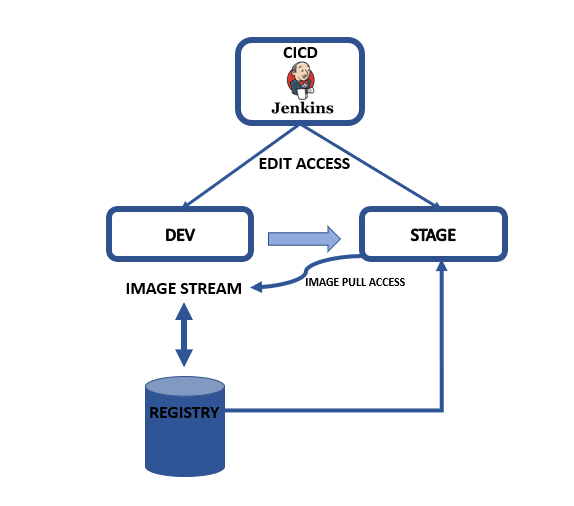

## OPENSHIFT ORIGIN V3.9 PIPELINE WITH JENKINS



In this example, the pipeline runs in the CICD Project.  We will build and deploy an application project named `cicd` & `Dev`, and  we will push the image created into a project named `stage`.

Here are the commands I used from the OpenShift CLI:

Create the following projects for CI/CD components, Dev and Stage environments:

```
# Create Projects
oc new-project cicd --display-name="CI/CD"
oc new-project dev --display-name="Tasks - Dev"
oc new-project stage --display-name="Tasks - Stage"

# Grant Jenkins Access to Projects
oc policy add-role-to-user edit system:serviceaccount:cicd:jenkins -n dev
oc policy add-role-to-user edit system:serviceaccount:cicd:jenkins -n stage

# Grant Image Pull access to stage project from dev, so that `stage` project can pull an image from the `dev` project.
oc policy add-role-to-user system:image-puller system:serviceaccount:stage:default -n dev

```
start working with cicd project,

```
oc project cicd
#create New Jenkins Pipeline BuildConfiguration from webconsole
Add to project > import yaml/json > copy the content from pipeline.yaml > create.

once it completed Edit "Jenkins Pipeline Configuration" and replace the content with Jenkinsconfig.txt
```

create a new Build Configuration and Deployment Configuration in `cicd project` & `dev project`
```
#create New php application from webconsole
php template > advanced option 
Name:myphp
Git Repository URL:https://github.com/venatrix/bg-demo.git
```
uncheck following options:-
```
In Build Configuration:-
    Automatically build a new image when the builder image changes
    Launch the first build when the build configuration is created
and Deployment Configuration:-
    New image is available
    Deployment configuration changes
create
```
Do the same in project `dev`

To create a deployment configuration in the `stage` project that points to the image from development project, create a service and route:
To check the `<<RegistryServiceIP>>` :-
project `dev` > builds > images - docker repo 
```
oc create deploymentconfig myapp --image=<<RegistryServiceIP>>:5000/dev/myapp:promote
```
To check the `<<RegistryServiceIP>>` :-
project `dev` > builds > images - docker repo  
```
oc expose dc myapp --port=8080
oc expose svc myapp
```
once all the above setup completed, start pipeline from project `cicd` builds > pipelines - start pipeline

#Thank you


